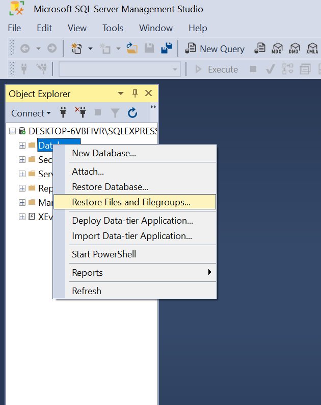
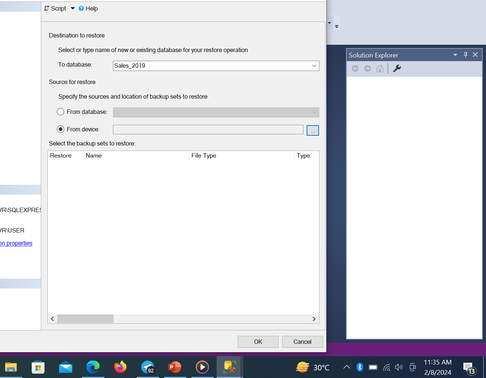
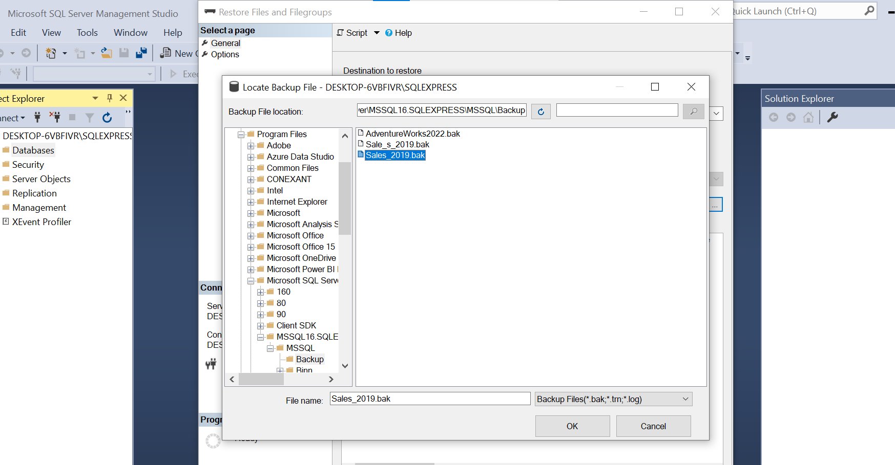
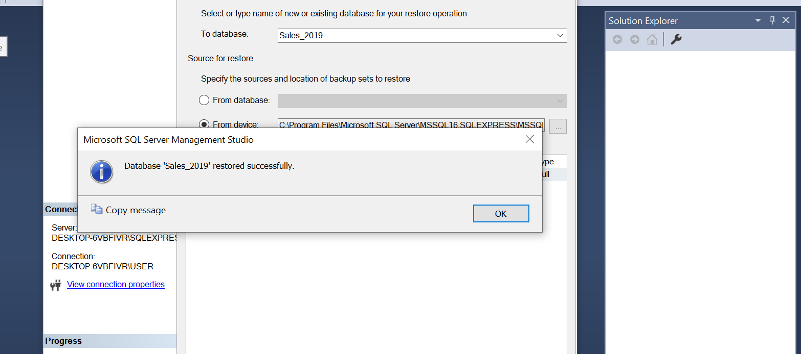

# Electronics And Appliances Sales Trend Analysis For Year 2019

## Introduction
  This Data was obtained from my data challenge group. It is data about different electronics and appliances, in different cities in the United States of America. It helps me Practice my skills on 
   about data cleaning, data analysis, and visualisation.

##  Skills Used;
1. SQL- For Data cleaning,Modelling And Analysis
2. Power Bi- For visualisation

##  Problem Statement
1. Uncover trends and patterns for the 2019 sales year. Generate key sales metrics.
2. The Accountant reported that we made loss in the month of April, May, June and July as compared to other month. Is this true? What happened? Show monthly sales performance
3. The Assistant manager suggested that we should place more marketing attention on the following cities - Los Angeles, New York, Atlanta, San Francisco and Seattle as they seem to generate more revenue. From the result of your analysis, do you agree with this? Should we proceed with the suggestion? 

## Data Sourcing
   The data was downloaded, it was in a .bak format, so it was not accessible. I had to download it into Sql to Retrieve the data and restore it for the data cleaning and analysis. The data had 12 different for each month.
   
  These are the step taken to retrive the data;
    
   
   
   
   
   
   
   

  This is the retrive data [here](https://github.com/Olan1ke/Sales_Trend_2019/blob/main/Sales_2019.sql)
   
## Data Transformation/Cleaning
  I combined all 12 tables to make cleaning and transforming easier and more efficient.These are the step I took in this process
  
1. I cleaned the February data first because I noticed the Order_Id was stored in date format. The query for the cleaning is [here](https://github.com/Olan1ke/Sales_Trend_2019/blob/main/Cleaning_Febuary_table.sql)
       I notice there were plenty empty space in the Order_Id of the february data,but I left it because i don't want to lose a data.

2. I combine all data from January to December,Using the new Cleaned February
      The query for combining the data is [here](https://github.com/Olan1ke/Sales_Trend_2019/blob/main/Combining_The_tables.sql)
      The Name of the combined tables is Combines_Sales_2019.

3. Then I started cleaning the combined table,with the following steps;-

-  Change Price_Each to Two Decimal place
-  Changing the Order_date to proper format
-  Remove duplicate
-  Create a Month column
-  Create a City column
-  Create a revenue column.
     All queries for this step is [here]()

5. 
## Data Modelling

## Data Analysis

## Data Visualation

## Insight

## Recomendation

