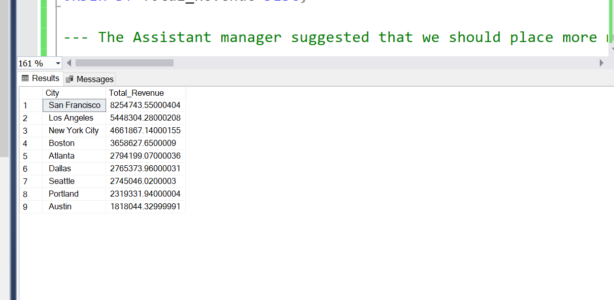

# Electronics And Appliances Sales Trend Analysis For Year 2019

## Introduction
  This Data was obtained from my data challenge group. It is data about different electronics and appliances, in different cities in the United States of America. It helps me Practice my skills on 
   about data cleaning, data analysis, and visualisation.

##  Skills Used;
1. SQL- For Data cleaning,Modelling And Analysis
2. Power Bi- For visualisation

##  Problem Statement
1. Uncover trends and patterns for the 2019 sales year. Generate key sales metrics.
2. The Accountant reported that we made loss in the month of April, May, June and July as compared to other month. Is this true? What happened? Show monthly sales performance
3. The Assistant manager suggested that we should place more marketing attention on the following cities - Los Angeles, New York, Atlanta, San Francisco and Seattle as they seem to generate more revenue. From the result of your analysis, do you agree with this? Should we proceed with the suggestion? 

## Data Sourcing
   The data was downloaded, it was in a .bak format, so it was not accessible. I had to download it into Sql to Retrieve the data and restore it for the data cleaning and analysis. The data had 12 different for each month.
   
  These are the step taken to retrive the data;
    
   
   
   
   
   
   
   

  This is the retrive data [here](https://github.com/Olan1ke/Sales_Trend_2019/blob/main/Sales_2019.sql)
   
## Data Transformation/Cleaning
  I combined all 12 tables to make cleaning and transforming easier and more efficient.These are the step I took in this process
  
1. I cleaned the February data first because I noticed the Order_Id was stored in date format. The query for the cleaning is [here](https://github.com/Olan1ke/Sales_Trend_2019/blob/main/Cleaning_Febuary_table.sql)
       I notice there were plenty empty space in the Order_Id of the february data,but I left it because i don't want to lose a data.

2. I combine all data from January to December,Using the new Cleaned February
      The query for combining the data is [here](https://github.com/Olan1ke/Sales_Trend_2019/blob/main/Combining_The_tables.sql)
      The Name of the combined tables is Combines_Sales_2019.

3. Then I started cleaning the combined table,with the following steps;-

-  Change Price_Each to Two Decimal place
-  Changing the Order_date to proper format
-  Remove duplicate
-  Create a Month column
-  Create a City column
-  Create a revenue column.
     All queries for this step is [here](https://github.com/Olan1ke/Sales_Trend_2019/blob/main/cleaning_The_Combined_Table.sql)

This is the result of the cleaned data 

## Data Analysis
 I genrated some key sales metrics to answer some question about the business;

 --- 1. Total Revenue for year 2019

SELECT SUM(Revenue) AS Total_Revenue_For_Year_2019

FROM Combined_Sales_2019;

This is the result;

--- 2. Total Quatity Sold

SELECT SUM(Quality_Ordered) AS Total_Quantity_Sold_For_Year_2019

FROM Combined_Sales_2019;

This is the result;

--- 3. Average price per product

SELECT Product, AVG(Revenue / Quality_ordered) AS Average_Price_Per_Product

FROM  Combined_Sales_2019

Where Product is not null

GROUP BY Product

Order By Average_Price_Per_Product Desc;

This is the result;

--- 4. Number of product sold

SELECT COUNT(DISTINCT Product) AS Distinct_Number_of_Products_Sold

FROM Combined_Sales_2019;

This is the result;

--- 5. Number sold per product

SELECT Product,COUNT(Product) AS Number_of_Products_Sold

FROM Combined_Sales_2019

Where Product is not null

GROUP BY Product
Order By Number_of_Products_Sold Desc;

This is the result;

--- 6. Revenue by product

SELECT Product, Sum(Revenue) As Total_Revenue_per_Product

FROM Combined_Sales_2019

Where Product is not null

GROUP BY Product

Order By Total_Revenue_per_Product Desc;

This is the result;

--- 7. Number of city 

SELECT COUNT(DISTINCT City) AS Distinct_Number_of_City

FROM Combined_Sales_2019;

This is the result;

--- 8. Revenue And Quality_Ordered by Month

SELECT Month, SUM(Revenue) AS Total_Revenue,Sum(Quality_Ordered) As Total_Quality_Ordered

FROM Combined_Sales_2019

WHERE Month IS NOT NULL

GROUP BY Month

ORDER BY Total_Revenue DESC;

This is the result;

--- 9.Revenue By City

SELECT City, SUM(Revenue) AS Total_Revenue

FROM Combined_Sales_2019

WHERE City IS NOT NULL

GROUP BY City

ORDER BY Total_Revenue DESC;

This is the result;

## Data Visualization
 The visualization for better insight was done on PowerBi.    
    
     This is the Sales Revenue Trend 2019 Visualization; 

  
 
## Insight

From the dashboard and Analysis,it is observed that;
 1. The total Revenue generated for the year 2019 is 3,446,5537
 2. The No of Product Sold is twenty (20)
 3. The Product is sold in nine (9) cities.
 4. Macbook Pro Laptop generated most revenue
 5. San Francisco city genrated the most revene while austin city generation the least.
  
## Conclusion And Recommendation
- To answer the Accountant The Accountant reported that we made loss in the month of April, May, June and July as compared to other month
  1. There should be more information about the sales like a profit column or a profit margin to be able to analysis the loss  well but since we don't have we use the revenue/no of order by month analysis.
  2. According to the analysis on visualiztion;The revenue generate and no of order on those month are not that bad,they are both on the average in those four months instead January, september, august, febuary should me look into because they generated the least revenue

- The Assistant manager suggestion about  placing more marketing attention on the following cities - Los Angeles, New York, Atlanta, San Francisco and Seattle as they seem to generate more revenue is a good but we replace seattle with Boston because Boston is in the first four cities which  generate the most revenue.

- LG Washing Machine and LG Dryer is the least sold product,I think there should be a kind of promotion for this two product or maybe a discount on both
- Revenue and order was more in December , I think more attention and promotion should be more in december because of the festive period.
